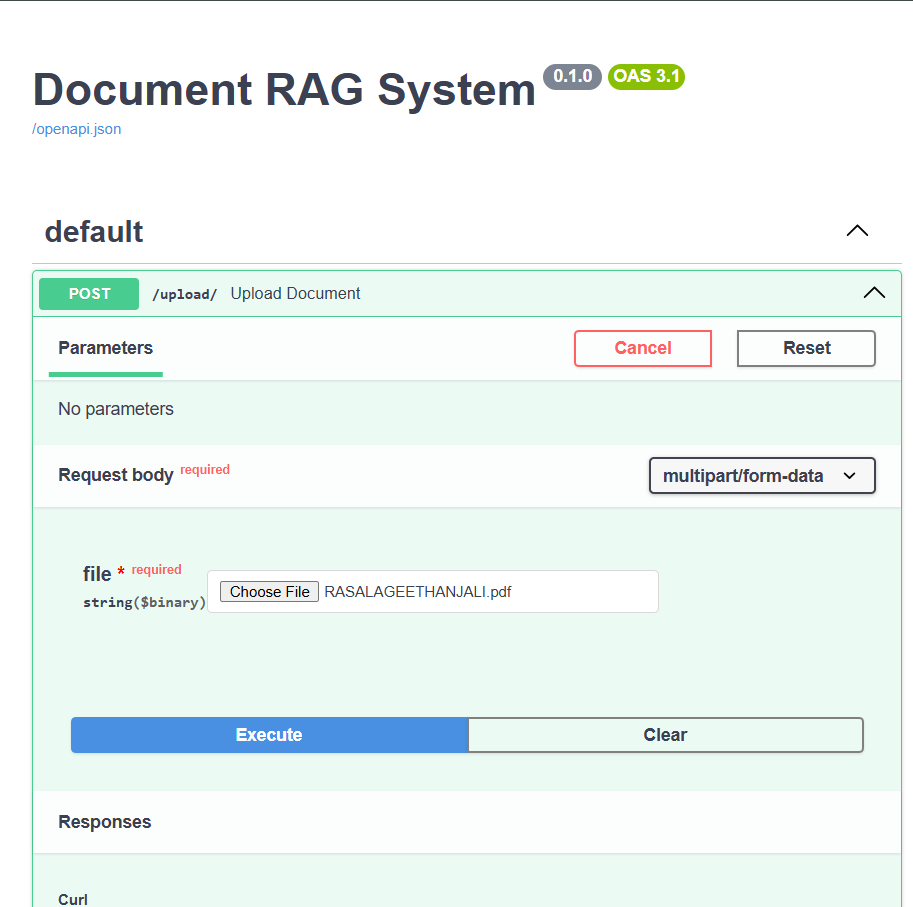
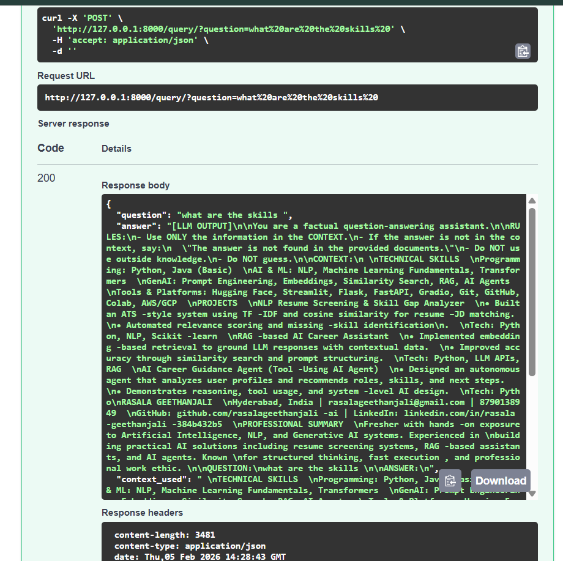

# 📄 Document RAG System  
> Retrieval-Augmented Generation backend using FastAPI, embeddings, and vector search

An end-to-end **RAG (Retrieval-Augmented Generation)** system that allows users to upload documents and ask questions strictly grounded in uploaded content.

---

## 🚀 Features
- 📂 Upload PDF documents
- ✂️ Chunk & embed document text
- 🧠 Semantic search using vector similarity
- 🧾 Strict RAG prompt (no hallucinations)
- ⚡ FastAPI backend
- 🧪 Modular, production-style architecture

---

## 🏗️ Architecture Flow

User Question
↓
Embedding Model
↓
Vector Store (Similarity Search)
↓
Relevant Context
↓
RAG Prompt
↓
LLM Answer

--------------------------------------------------------
---

## 📁 Project Structure

document-rag-system/

├── app/
│ ├── api/ # Upload & query endpoints
│ ├── embeddings/ # Embedding model wrapper
│ ├── retrieval/ # Vector store & retriever
│ ├── generation/ # Prompt & LLM interface
│ └── main.py # FastAPI entry point
│
├── project-result/ # Execution screenshots
├── requirements.txt
├── README.md
└── .gitignore

------------
---

## ⚙️ Tech Stack
- Python 3.11
- FastAPI
- Sentence-Transformers
- ChromaDB
- PyPDF2
- Uvicorn

---

## ▶️ Run Locally

```bat
python -m venv venv
venv\Scripts\activate
pip install -r requirements.txt
uvicorn app.main:app --reload

----------------------------------------------------------------------------------------------------
🔹 API Endpoints
Upload Document

POST /upload
Uploads PDF → chunks → embeddings → vector DB

Query Document

POST /query?question=...
Semantic search → context → RAG answer
-----------------------------------------------------------------------------------------------------------
📸 Project Results
Swagger UI

PDF Upload

Query Execution

Retrieved Context & Answer

## 📸 Project Results

### 🔹 Upload Document


### 🔹 Query Execution


### 🔹 Retrieved Context


### 🔹 LLM Answer


### 🔹 Final Response


-----------------------------------------------------------------------------------------------------------
🚀 Future Improvements

Cloud deployment (Render / AWS)

Authentication & sessions

Persistent vector DB

Real LLM integration

Frontend UI
------------------------------------------------------------------------------------------------------------
👩‍💻 Author

Rasala Geethanjali
AI & ML Engineering Student
Focused on real-world GenAI systems
----------------------------------------------------------------------------------------------------------
